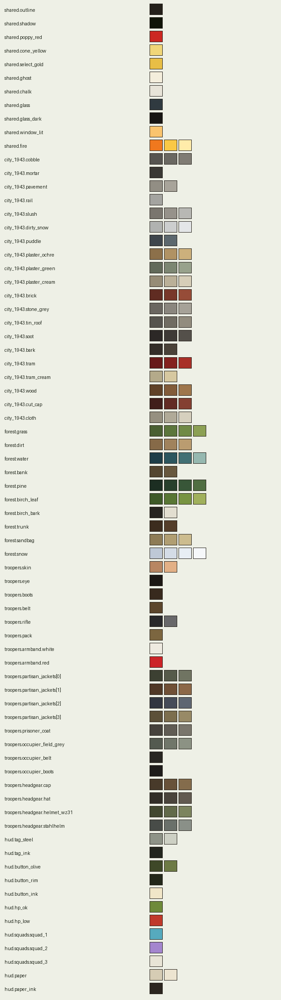
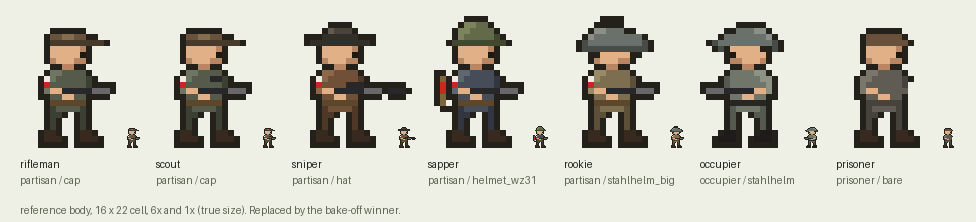

# Minor Sabotage: art style guide

This is the specification anyone drawing for the game works from, whether that is Claude (Opus or
Fable) writing sprite code, a Blender script, or later an image model. It holds the rules. Colours
live in [`palette.json`](palette.json), and every generator reads them from there. The pictures below
are generated by [`tools/art/reference_sheet.py`](../../tools/art/reference_sheet.py).

Decisions this guide follows (vault, `projects/minor-sabotage/decisions/`):
direction C "Diorama" (2026-09-27), the street cut with ghost outlines (2026-09-27), and for now
Claude draws, as code (2026-09-28). The stack is in [ADR-0001](../adr/0001-typescript-phaser-with-rules-apart-from-the-engine.md).
The mock-ups the look was chosen from: https://claude.ai/artifact/HuLDziWgQapPiqizjX38hH

## 1. The look in one paragraph

A steep three-quarter view, about 55°, over a tile map, with drawn buildings and props standing on
it. The pixel art is chunky, and the troopers have big heads: the headgear is a third of the body,
so the role reads first. The colours are earthy (plaster, brick, soot, field grey, olive), and red
is kept for the things that matter. The surface is cheerful, with Cannon Fodder's wink in the
missions, and the grief comes on the screens between them. Commandos lends it a sense of place:
building fronts, long shadows, guard cones, and a silhouette when someone is behind a roof.

## 2. Grid, camera and scale

| | value |
|---|---|
| Art pixel on an iPhone | 1.5 pt, so an iPhone 15 held sideways (852 × 393 pt) shows **568 × 262 art px** |
| Art pixel on a PC | the same map in any window (Tom, 2026-09-28): the full-screen 1080p view, **480 × 270 art px**, fitted to the window. Full screen at 1080p, 125 % or 150 % that is 4 screen pixels to an art pixel; a window of another height gets art pixels a screen pixel wider or narrower by turns |
| Art pixel on other dense screens | tablets and Macs (2× density or more): 1, 1.5, 2, 3… pt, the largest that still shows **480 × 240 art px** |
| World scale | **12 art px per metre** across, **9 px per metre** into the screen (depth factor 0.75) |
| Height | **7.5 px per metre** up. A storey is 3.2 m = **24 px** |
| Ground tile | **2 m × 2 m = 24 × 18 px**. The screen holds about 23.7 × 14.5 tiles |
| Trooper | **22 px tall** in a **16 × 22 cell**, feet on the bottom row. 22 px = 33 pt on the phone, under Apple's 44 pt tap minimum, so hit areas are enlarged and the squad bar selects |
| View | about 26 soldier-heights across, so weapon and alarm ranges are set in soldier-heights (≈ 26) |
| Drawing order | by the y of the feet (the south edge of a footprint). Props mark the tiles they block, in Tiled |

The mock-ups used 11 px per metre and a depth factor of 0.8. The guide rounds these to 12 and 0.75
so that a tile is a whole number of pixels.

A point on the ground at `(x, y)` metres and height `z` lands at
`sx = x·12`, `sy = y·9 − z·7.5` (art px, before the camera offset). Everything is drawn at 1× in art
pixels and scaled up with nearest-neighbour sampling, never smoothed: by a step in points on a
phone or another dense screen, and on a PC by whatever fits the 1080p view to the window.

**Text is the exception** (Tom, 2026-09-28: the pixel faces could not be read on a PC). Words are
set in two bundled faces and drawn at the screen's own resolution, not in art pixels: the typewriter
Courier Prime on the paper screens (intro, chapter card, briefing, decision, history note), and the
condensed sans Barlow Semi Condensed in the HUD, on the street and on buttons. They keep the pixel
faces' three sizes and line pitches (`game/src/ui/text.ts`). Lettering that is part of a picture,
such as the logo and the shop signs, stays pixel.

## 3. Colour

- **One palette file.** Nothing hard-codes a colour. A biome uses at most about 48 colours,
  including the shared ones.
- **Ramps of 3 or 4**, dark to light. Sprites use at most 4 tones per material.
- **Reserved colours.** `poppy_red` is for the armband's red half, the sapper's charge, danger and
  the grave screen. `cone_yellow` is only for guard cones. `select_gold` is only for your selection,
  route and destination. The three squad colours are only for squad tags and order markers. None of
  these appear in scenery.
- **March 1943** (the Arsenal demo) is late winter: bare trees, dirty snow in gutters and on
  sills, slush on the cobbles, puddles. The city is intact.
- **The forest**: pine and birch, peat, sand tracks. Snow is a palette swap, not new art.

## 4. Outline, shading, dither

- A **1 px outline** in `outline`, the palette's dark brown-black, never pure black. On props, the
  outline is kept on the bottom and right edges and may be dropped on edges facing the light.
- **Light comes from the top left** (north-west). Top-left faces get the lightest tone, and
  bottom-right faces the darkest.
- **Dither only on ground and foliage**, with a 4 × 4 Bayer pattern. Never dither troopers, faces or
  HUD.
- **Shadows** are a single `shadow` colour at 27% (day) to 33% (dusk) opacity, cast toward the
  south-east by day and long to the east at dusk.

## 5. Light and weather

The light is a layer over the finished frame, not a second set of art.

- **Ambient** multiplies the frame by `light.ambient` for day, afternoon, dusk or night. The Arsenal
  demo is played in `afternoon`, around five o'clock on 26 March.
- **Pools** (lamp, fire, window, flare, searchlight) add light in **three stepped bands with a
  dither**, never smooth. At night, pools are where you get seen, so their edges must read as edges.
- **Weather**: rain darkens the scene and adds 3 px diagonal streaks. Snow swaps the ground ramps and
  adds 1 to 2 px flakes.

## 6. Troopers

**Body types.** Each body type is drawn once, and roles are paper-doll layers on top of it.

| body | kit | notes |
|---|---|---|
| partisan | cap, hat, wz.31 helmet or a captured Stahlhelm; rifle; white-and-red armband | every jacket a different colour (`partisan_jackets`) |
| occupier | Stahlhelm (the flared outline alone identifies him), field grey | **no insignia**: the helmet reads at 22 px |
| prisoner | bare head, prison coat, no kit | walk and death only; follows the nearest trooper |
| Cichociemni | later: paratrooper kit for the drop, civilian clothes after | needs its own small cue in civilian clothes |

**Role cues**, which must read at 1×: the **scout** has a cap and binoculars, the **sniper** a
brimmed hat and a long rifle, the **sapper** a pack with a red charge, the **driver** a cap with a
tag glyph (no vehicle cue yet), and the **rookie** an oversized captured helmet over his eyes.

**Frames per body type.** Five facings are drawn (south, south-east, east, north-east, north), and
the three western facings are mirrored.

| action | frames |
|---|---|
| idle | 1 |
| walk | 4 |
| fire | 2 |
| throw | 3 |
| hit and death | 5 |
| swim | 2 |
| prone | 2 |
| knife kill | 3 |
| kneel and work (picking up kit, planting a charge, painting a wall, taking down a plaque) | 2 |

That is **24 frames × 5 facings = 120 drawings** per body type. Carry, escort and stretcher
animations are not needed. Rudy is lifted into the car in one beat (door open, two silhouettes,
door shut), and a raised alarm is a glyph over the guard's head, not a pose.

## 7. Buildings, props and the cut

- **Buildings** are boxes on the tile grid with a front wall (24 px per storey), a roof, and a
  window grid. Windows are 0.9 × 1.5 m, and shop fronts on the ground floor are 1.4 × 2 m.
  Each window is glass, dark, lit or burning.
- **The street cut.** Each building group carries the id of the street it fronts. While the squad
  is in a street, heading into it by the next stretch of its route, every building on the near
  (south) side of that street is drawn cut: walls at knee height (1 m, about 8 px), a `cut_cap` on
  top, floorboards and a few pieces of ground-floor furniture inside. Every cuttable building
  therefore needs a cut version.
- **The ghost.** A cut building also draws a 1 px dotted outline (every 3rd pixel, `ghost` at 80%)
  of its full volume: the roof rectangle and the two front corners.
- **Damage states.** Props that tasks change are drawn twice, intact and destroyed, because the
  finale plays on the map the tasks left: the prison truck, cars, the phone line and its poles,
  and anything that can burn.
- **The Arsenal** is the demo's landmark and is drawn as a unique set piece, not from the generic
  building kit.
- **Symbols.** The Kotwica is protected by a Polish act of 2014 and is not reproduced. Wall paint
  uses stencilled slogans and the minor-sabotage turtle ("Pracuj powoli").

## 8. Markers and HUD

- **On the map:** a guard's cone is a checker stipple of `cone_yellow`, 42% on the fill and 85% on
  the edge. Your route is dotted `select_gold` ending in a diamond, and the selected trooper has a
  gold ellipse. A trooper hidden behind a roof shows as a dotted outline, gold for yours and red
  for theirs.
- **Orders for squads you are not playing** are drawn in that squad's colour: a hold flag, a cover
  cone, and a dotted route that ends in a "waits for signal" mark.
- **The HUD**, laid out as in the port: the roster at the top left, FIRE and GRENADE under the left
  thumb, and pause and map at the top right, with a go-code button next to the thumb buttons.
  Each trooper's roster chip is a stamped identity tag (steel, with a hole, name, rank chevrons, a
  face cropped from the sprite, and health). A promotion re-stamps the tag, and a death turns it
  into the grave marker.
- **Squad tags** switch control and must read as three different squads, by colour
  (`hud.squads`) and by the leader's nom de guerre.
- **The pause banner** names who was hit and where.

## 9. Screens

- **Briefing:** a drawn city plan of the operation's map, like an underground sketch map on
  paper (`hud.paper`). Three task cards sit on it, and squad tags are dragged onto them.
- **The fallen:** birch crosses, and headstones that grow with rank, each with a nom de guerre.
  Volunteers queue at a forest camp under a white-and-red flag.
- **History note** at mission complete: paper and ink only, no jokes and no animation. It gives the
  real names, the dates and what happened after, including the reprisals. For the Arsenal action,
  140 prisoners, Poles and Jews, were shot in the Pawiak courtyard on 27 March 1943.

## 10. Bake-off: who animates the troopers

The first build. One partisan rifleman, drawn two ways, each with **idle plus the walk (4 frames)
in all 5 facings**:

1. **Pixel templates written by Claude**, frame by frame, in the 16 × 22 cell, like the reference
   above.
2. **A Blender script** (Claude builds a low-poly model from primitives, rigs it, poses the walk and
   renders each facing at 22 px, flat-shaded with no anti-aliasing), then reduced to the palette
   with the outline added. Blender is not yet installed on forge.

Both produce a contact sheet at 1× and 4×, plus a phone page that walks the soldier in a circle on
the Arsenal cobbles. Tom judges them on the phone. What counts: whether the silhouette stays the
same from frame to frame, whether you can tell which way he faces at 1×, and how much work the next
119 drawings will take.

## 11. Files

| path | what |
|---|---|
| `docs/art/palette.json` | every colour |
| `docs/art/style-guide.md` | these rules |
| `tools/art/reference_sheet.py` | renders `palette.png` and `troopers.png` from the palette |
| `tools/art/…` | future generators (tiles, props, troopers). Each writes its sheet to the game's asset folder and never edits by hand |
